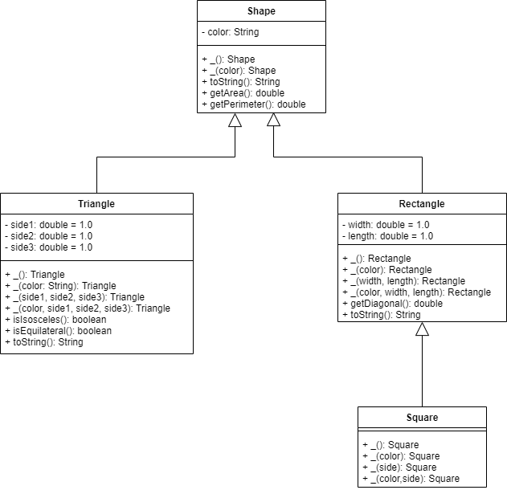
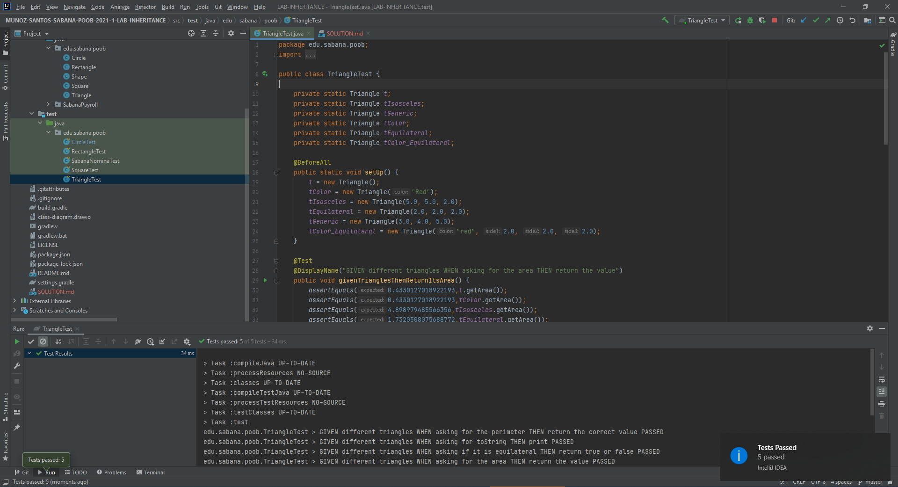
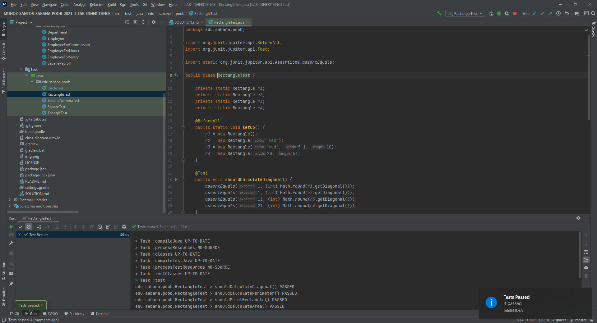
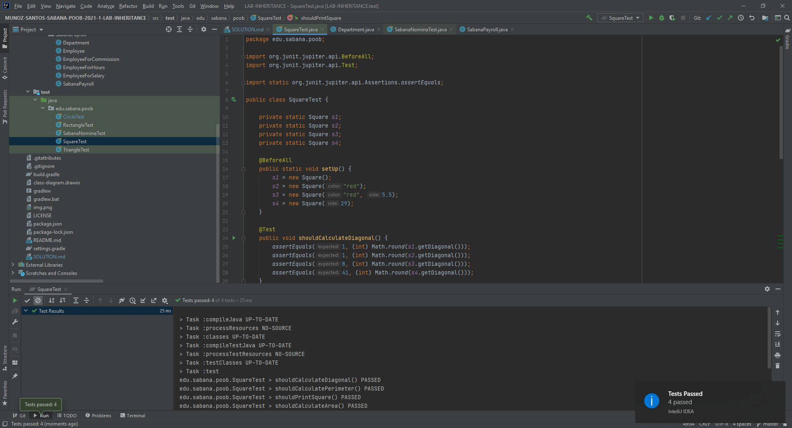
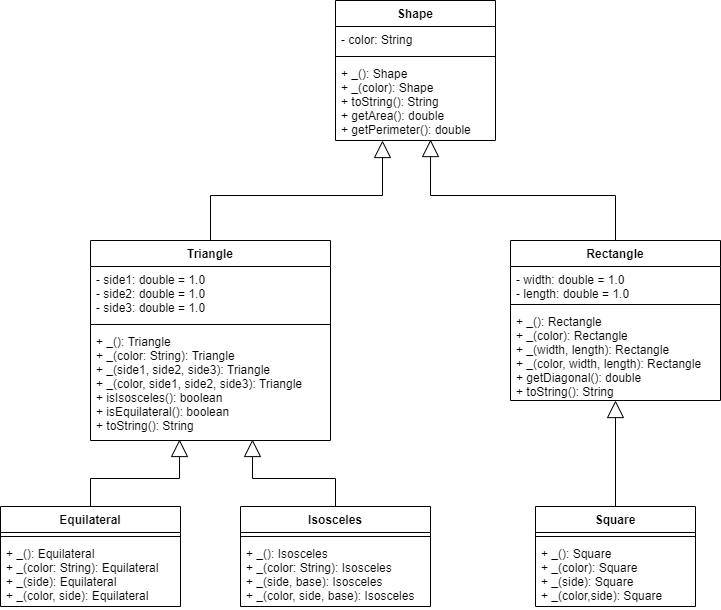
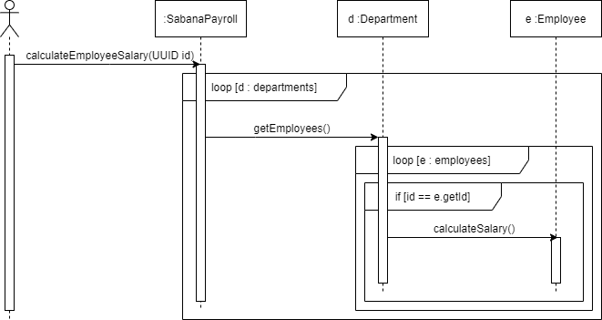

# SOLUTION LAB-INHERITANCE
## Parte I - Entendiendo las Interfaces `Shape`
### Respuesta
* ¿Cuál es la relación entre `Circle` y `Shape`?
  
    La relación entre Circle y Shape es de herencia, Circle hereda de Shape.
* ¿Cuál es la relación entre `Cylinder` y `Shape`?

    La relación entre Cylinder y Shape es de herencia, Cylinder hereda de Circle y este hereda de Shape.
* ¿Cuál es la relación entre `Circle` y `GeometricShape2D`?
  
    La relación entre Circle y GeometricShape2D es: Circle es un GeometricShape2D.
* ¿Cuál es la relación entre `Cylinder` y `GeometricShape3D`?

  La relación entre Cylinder y GeometricShape3D es: Cylinder es un GeometricShape3D.
## Parte II - Implementando herencia
### Evidencia Diseño

### Clase `Triangle` evidencia test

### Clase `Rectangle` evidencia test

 
### Clase `Square` evidencia test
 

## Parte III - Diseñando Herencia
### Diseño

## Parte IV - Herencia en un contexto
### Diseños
### `Diagrama de Clases`

### `Diseño printPayroll`

### `Diseño calculateEmployeeSalary`

### `Diseño calculateDepartmentSalaries`

### `Diseño calculateUniversitySalaries`

### Evidencias
### `Evidencia Test`

### `Imprimir la lista de empleados`
