# SOLUTION LAB-INHERITANCE
## Parte I - Entendiendo las Interfaces `Shape`

* ¿Cuál es la relación entre `Circle` y `Shape`?
  
    La relación entre Circle y Shape es de herencia, Circle es un Shape.
  

* ¿Cuál es la relación entre `Cylinder` y `Shape`?

    La relación entre Cylinder y Shape es de herencia, Cylinder es un Circle y por ende es un Shape.
  

* ¿Cuál es la relación entre `Circle` y `GeometricShape2D`?
  
     Circle es un GeometricShape2D.
  

* ¿Cuál es la relación entre `Cylinder` y `GeometricShape3D`?

   Cylinder es un GeometricShape3D.
### Evidencia de pruebas clase `CircleTest`
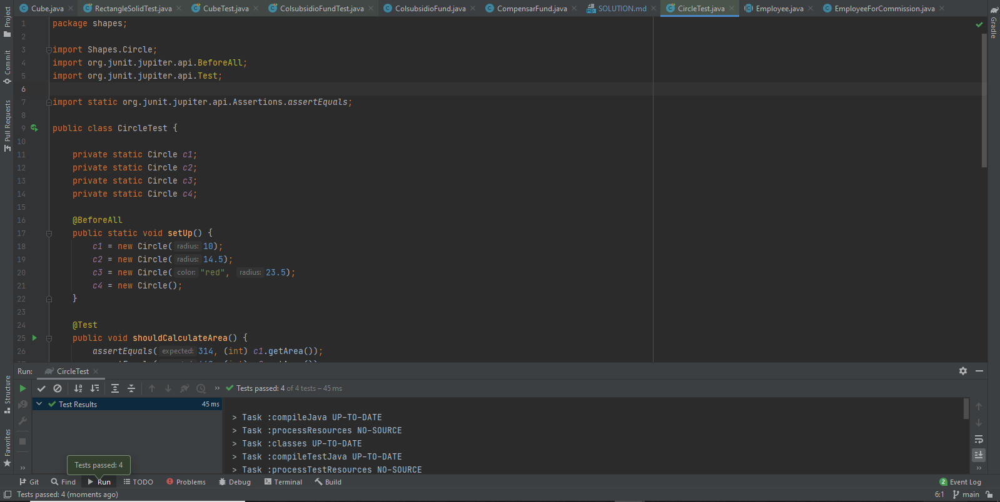
### Evidencia de pruebas clase `CylinderTest`

## Parte II - Implementando herencia

### Evidencia de pruebas clase `PyramidTest`
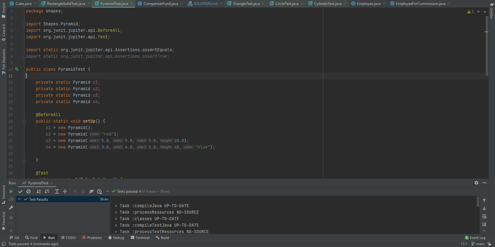
### Evidencia de pruebas clase `RectangleSolidTest`
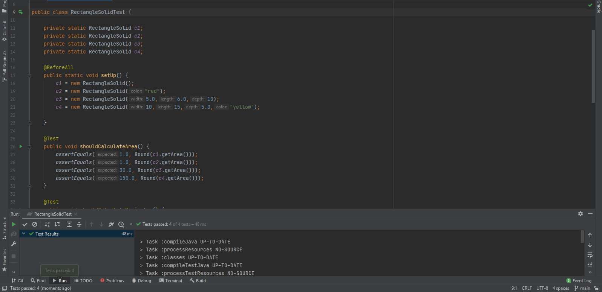

### Evidencia de pruebas clase `TriangleTest`
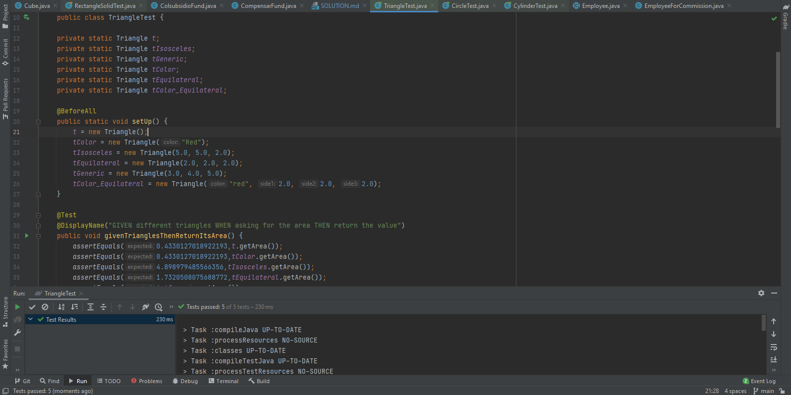
### Evidencia de pruebas clase `RectangleTest`
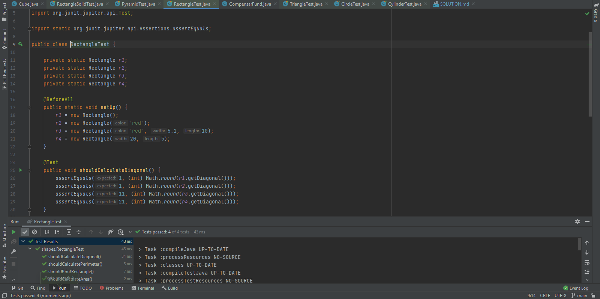

### Evidencia de pruebas clase `CubeTest`
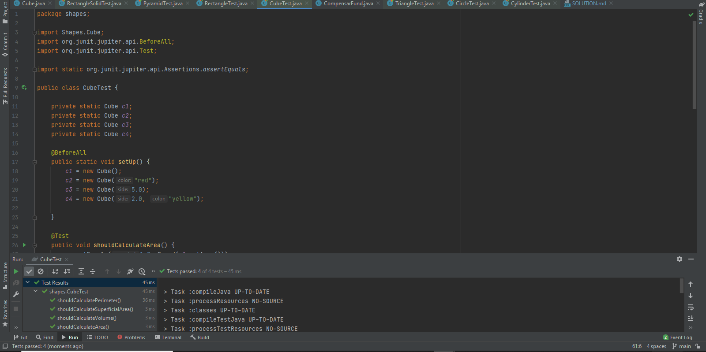

## Parte III - Diseñando Herencia
### Diseño
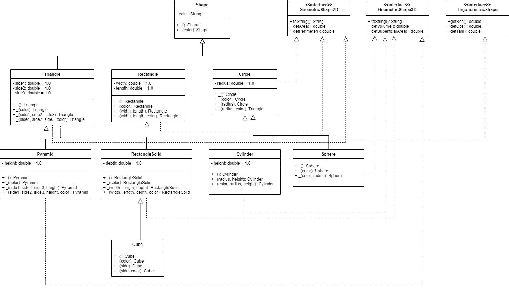

## Parte IV - Herencia en un contexto
### Diseños
### `Diagrama de Clases`
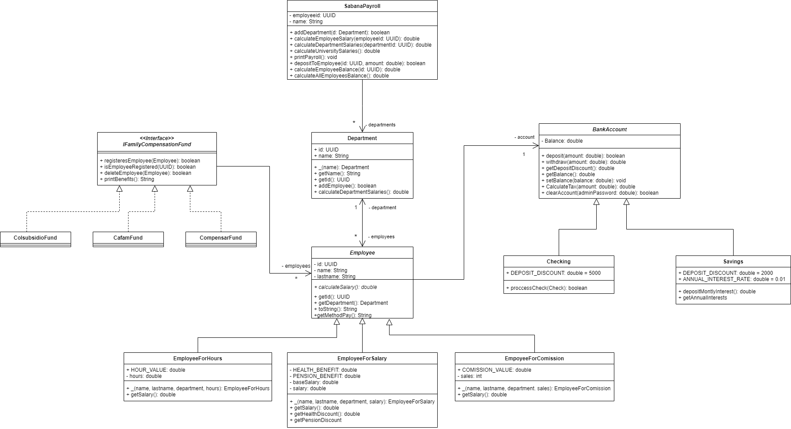
### `ColsubsidioFundTest`
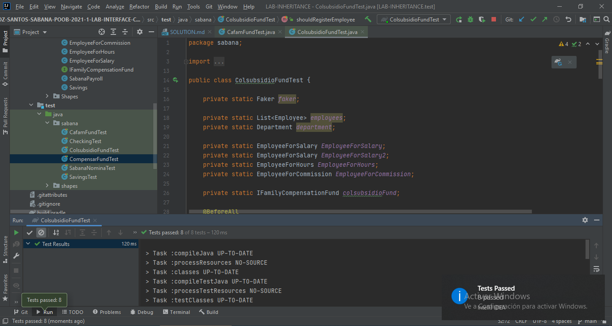
### `CompensarFundTest`

### `Diagrama de Clases`
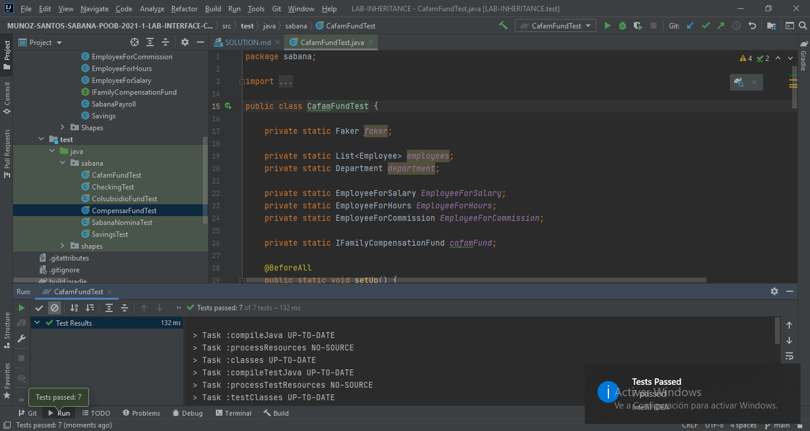

## Parte V - Interfaces Integrando
### `Diagrama de Clases`
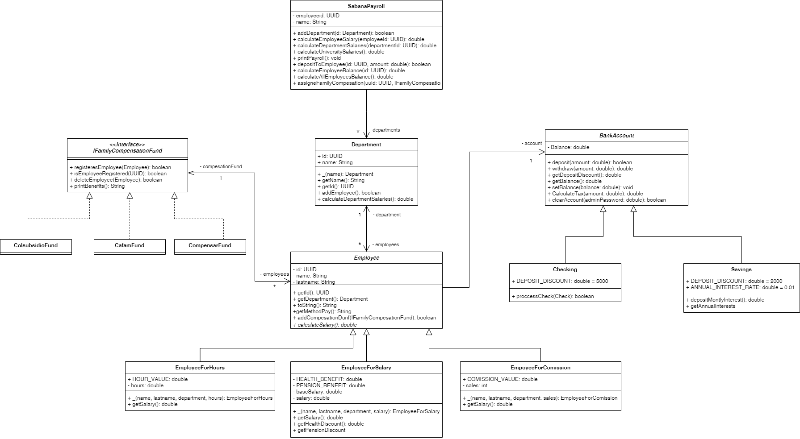
### `SabanaNominaTest`
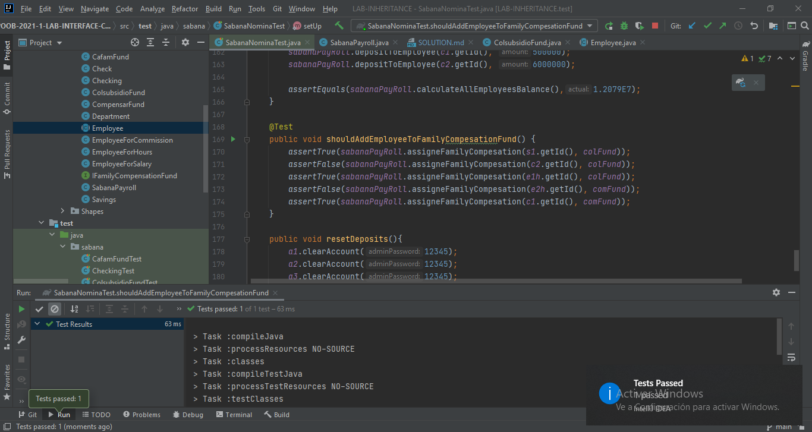

## Parte VI - Interfaces Diseñando en un contexto
### `Diagrama de Clases`
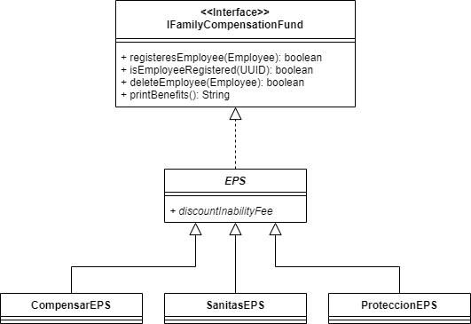