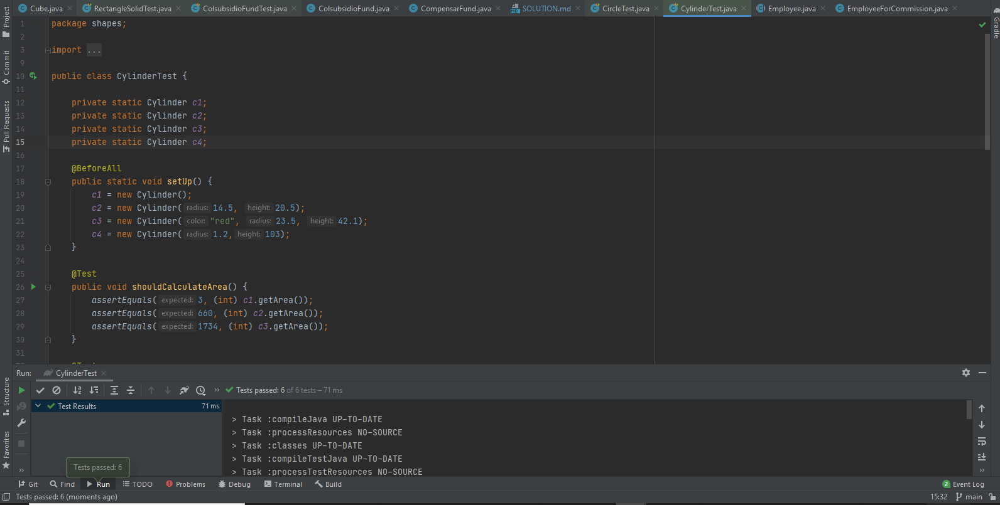

# SOLUTION LAB-INHERITANCE
## Parte I - Entendiendo las Interfaces `Shape`

* ¿Cuál es la relación entre `Circle` y `Shape`?
  
    La relación entre Circle y Shape es de herencia, Circle es un Shape.
  

* ¿Cuál es la relación entre `Cylinder` y `Shape`?

    La relación entre Cylinder y Shape es de herencia, Cylinder es un Circle y por ende es un Shape.
  

* ¿Cuál es la relación entre `Circle` y `GeometricShape2D`?
  
     Circle es un GeometricShape2D.
  

* ¿Cuál es la relación entre `Cylinder` y `GeometricShape3D`?

   Cylinder es un GeometricShape3D.
### Evidencia de pruebas clase `CircleTest`

### Evidencia de pruebas clase `CylinderTest`

## Parte II - Implementando herencia

### Evidencia de pruebas clase `PyramidTest`

### Evidencia de pruebas clase `RectangleSolidTest`

### Evidencia de pruebas clase `TriangleTest`

### Evidencia de pruebas clase `RectangleTest`

### Evidencia de pruebas clase `CubeTest`

## Parte III - Diseñando Herencia
### Diseño

## Parte IV - Herencia en un contexto
### Diseños
### `Diagrama de Clases`

### `Diseño printPayroll`

### `Diseño calculateEmployeeSalary`

### `Diseño calculateDepartmentSalaries`

### `Diseño calculateUniversitySalaries`

### Evidencias
### `Evidencia Test`

### `Imprimir la lista de empleados`
